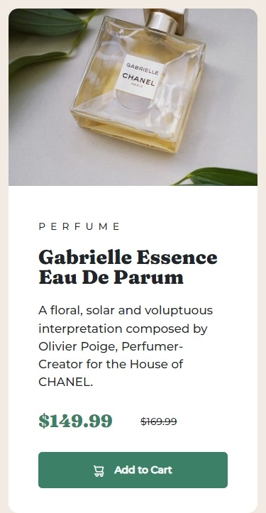

# Frontend Mentor - Product preview card component solution

This is a solution to the [Product preview card component challenge on Frontend Mentor](https://www.frontendmentor.io/challenges/product-preview-card-component-GO7UmttRfa). Frontend Mentor challenges help you improve your coding skills by building realistic projects.

## Table of contents

- [Overview](#overview)
  - [The challenge](#the-challenge)
  - [Screenshot](#screenshot)
  - [Links](#links)
- [My process](#my-process)
  - [Built with](#built-with)
  - [What I learned](#what-i-learned)
  - [Continued development](#continued-development)
  - [Useful resources](#useful-resources)
- [Author](#author)
- [Acknowledgments](#acknowledgments)

## Overview

### The challenge

Users should be able to:

- View the optimal layout depending on their device's screen size
- See hover and focus states for interactive elements

### Screenshot




### Links

- Solution URL: [Solution on GitHub](https://github.com/horoserp/product-card)
- Live Site URL: [Solution on Live Site](https://horoserp.github.io/product-card)

## My process

### Built with

- Bootstrap 5
- CSS modifications

### What I learned

This challenge was harder than I expected. I had to revisit a lot of material from Bootstrap and how to utilize its responsiveness, especially when it came to images. I learned a lot about how to override Bootstraps standard color theme and button styles. Also, while catching up on my LinkedIn feed, I read about the use of the CSS :where() Pseudo-Class and was able to utilize that in my code (see below):

```css
:where(h2, h3) {
  font-family: "Fraunces";
}
```

### Continued development

This challenge made me aware that I need to focus more on using CSS with images effectively and efficiently. Also, I realized my Bootstrap skills have got a little rusty since gaining my Certification through W3Schools, so continued utilization and practice are needed.

### Useful resources

- [W3Schools](https://www.w3schools.com/) - This is a great reference site which helped me remember some of the required syntax and generalities surrounding the base of a react project.
- [Stack Overflow](https://stackoverflow.com/) - This is an excellent resource for finding answers to precise questions. I used it once or twice during this challenge.
- [Bootstrap](https://getbootstrap.com/docs/5.0/getting-started/introduction/) - This is the Bootstrap 5.0 documentation page. I spent a lot of time revisiting syntax and examples on this site.

## Author

- Website - [Robert P. Horosewski](https://horoserp.github.io/React-Portfolio)
- Frontend Mentor - [@horoserp](https://www.frontendmentor.io/profile/horoserp)
- LinkedIn - [Robert P. Horosewski](https://www.linkedin.com/in/robert-horosewski-8a0608196/)

## Acknowledgments

Thanks to my wife for the encouragement to pursue my dream.
